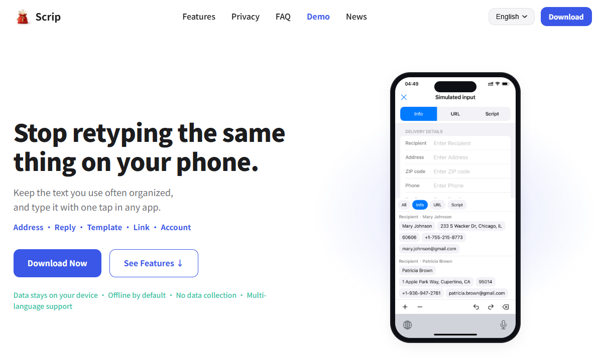

# Scrip

🌐 **English** | [简体中文](README.zh-CN.md)



[](https://testflight.apple.com/join/a4znnchm)


> Manage repeat text — don't retype it.

Scrip is a local-first text-reuse tool for phones, tablets, and other portable devices.

It helps you organize content that you **rarely read again but keep retyping**, such as:

- Shipping addresses
- Common replies
- Self-introductions
- Account information
- Templates
- Frequently used links

Organize it once, then enter it anywhere with one tap via Scrip's custom keyboard — no more manual retyping, and no more switching back and forth between notes, chat history, and text fields to copy and paste.

All data is stored locally on your device only, never uploaded or collected, and the app is offline by default.

## About This Repository

This repository (`Scrip-release`) publishes Scrip's public information and documentation, including:

- Privacy Policy
- User Agreement
- Changelog
- Platform-specific public documents

It also collects bug reports, feature requests, and feedback via [Issues](../../issues).

Because Scrip is built local-first, this repository also serves as a public entry point where anyone can review the privacy policy, track releases, and understand how the product handles data.

## Features

### 📁 Manage Repeat Text

Organize frequently entered content by scenario — work, life, accounts, templates, and more.

### ⌨️ One-Tap Input

Bring up the Scrip keyboard in any app and enter text with a tap — no copy-pasting required.

### 🧩 Organized for Reuse

Structure repeat text into forms that are easier to reuse, such as structured addresses or reusable templates.

### 🔒 Local-First

- All data is stored locally on your device only
- Offline by default
- No user data is collected
- The custom keyboard never logs what you type in other apps

### 🌍 Multi-Language

English, Simplified Chinese, Traditional Chinese, Japanese, Korean, Spanish, German, French

## Repository Structure

```text
/
├── iOS/
│   ├── PrivacyPolicy.zh-CN.md
│   ├── PrivacyPolicy.en.md
│   └── ...
├── CHANGELOG.md
└── README.md
```

More platform folders, such as `Android/` and `macOS/`, will be added over time.

## 🧪 Beta Testing

The iOS version is now in Beta testing. Join via TestFlight, and share feedback or suggestions through [Issues](../../issues) or other official channels:

<https://testflight.apple.com/join/a4znnchm>

## Privacy

Scrip is committed to a local-first approach:

- Data is stored locally on your device only
- Offline by default
- No user data is collected
- No input content is ever uploaded

For more information, see the [Privacy Policy (English)](iOS/PrivacyPolicy.en.md) / [隐私政策（简体中文）](iOS/PrivacyPolicy.zh-CN.md).

## Feedback

Bug reports, feature requests, and feedback are all welcome: 👉 [Issues](../../issues)
