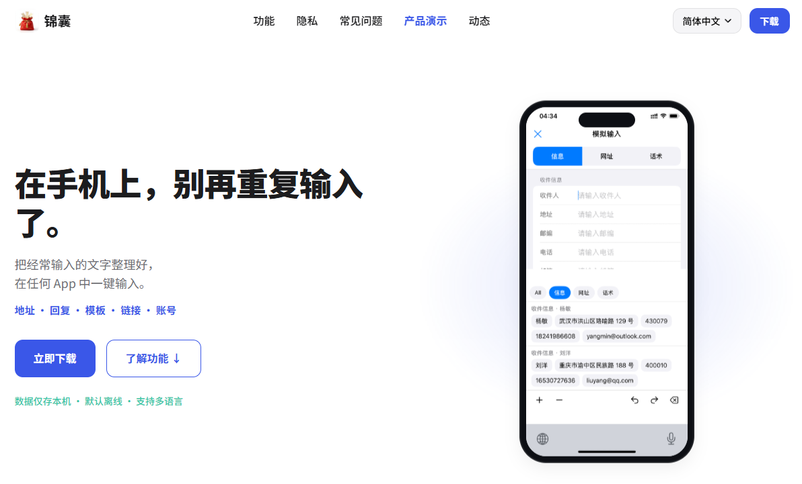

# 锦囊

🌐 [English](README.md) | **简体中文**



> 管理重复文字，而不是重新输入它。

锦囊是一款面向手机、平板等便携设备的本地优先文字复用工具。

它帮助你整理那些**不会反复阅读，却会反复输入**的内容，例如：

- 收货地址
- 常用回复
- 自我介绍
- 账号信息
- 模板
- 常用链接

整理一次，在任何 App 中通过锦囊自定义键盘一键输入，不必反复手打，也无需在备忘录、聊天记录和输入框之间来回复制粘贴。

所有数据仅保存在设备本地，不上传、不采集，默认离线。

## 关于本仓库

本仓库（`Scrip-release`）用于发布锦囊的公开信息与文档，包括：

- 隐私政策
- 用户协议
- 更新日志
- 平台相关公开文档

同时，通过 [Issues](../../issues) 接收缺陷报告、功能建议与使用反馈。

由于锦囊采用本地优先设计，本仓库也作为公开入口，方便用户查阅隐私政策、跟踪版本更新，并了解产品的数据处理方式。

## 功能

### 📁 管理重复文字

按场景整理经常输入的内容，例如工作、生活、账号、模板等。

### ⌨️ 一键输入

在任意 App 中唤起锦囊键盘，轻点即可输入，无需复制粘贴。

### 🧩 为复用而整理

将重复文字组织成更容易再次使用的形式，例如结构化地址、可复用模板等。

### 🔒 本地优先

- 所有数据仅保存在设备本地
- 默认离线
- 不采集用户数据
- 自定义键盘不会记录你在其他 App 中输入的内容

### 🌍 多语言

简体中文、繁體中文、English、日本語、한국어、Español、Deutsch、Français

## 仓库结构

```text
/
├── iOS/
│   ├── PrivacyPolicy.zh-CN.md
│   ├── PrivacyPolicy.en.md
│   └── ...
├── CHANGELOG.md
└── README.md
```

后续将根据平台增加对应目录，例如 `Android/`、`macOS/`。

## 🧪 Beta 测试

iOS 版本已进入 Beta 测试，欢迎通过 TestFlight 加入体验，并通过 [Issues](../../issues) 或其他官方渠道反馈问题与建议：

<https://testflight.apple.com/join/a4znnchm>

## 隐私

锦囊坚持本地优先原则：

- 数据仅保存在设备本地
- 默认离线运行
- 不采集用户数据
- 不上传输入内容

更多信息请参阅：[隐私政策（简体中文）](iOS/PrivacyPolicy.zh-CN.md) / [Privacy Policy (English)](iOS/PrivacyPolicy.en.md)。

## 反馈

欢迎提交缺陷报告、功能建议或使用反馈：👉 [Issues](../../issues)
